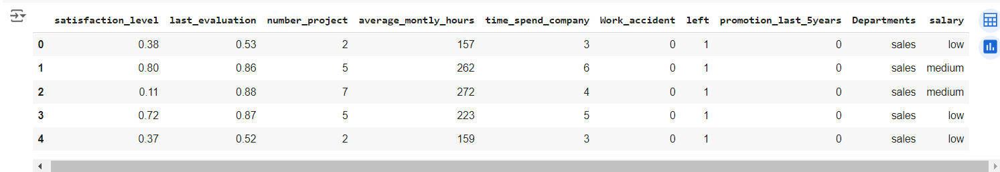
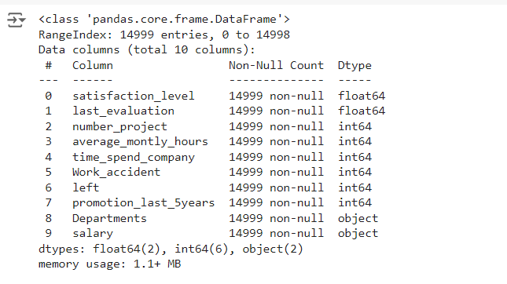
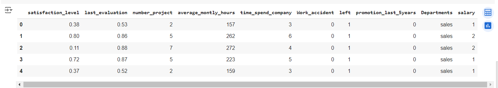
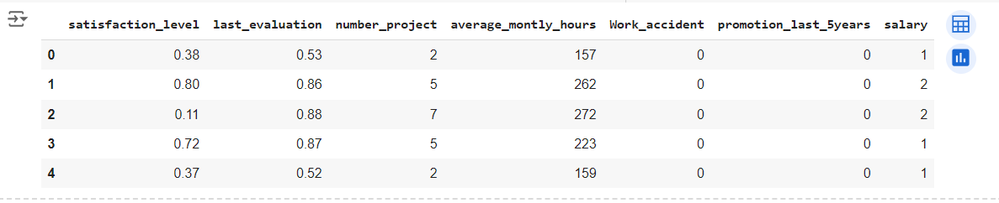
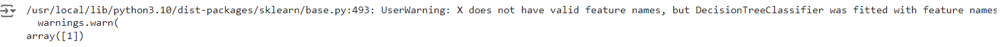

# Implementation-of-Decision-Tree-Classifier-Model-for-Predicting-Employee-Churn

## AIM:
To write a program to implement the Decision Tree Classifier Model for Predicting Employee Churn.

## Equipments Required:
1. Hardware – PCs
2. Anaconda – Python 3.7 Installation / Jupyter notebook

## Algorithm
1. Start the program by importing required libraries.
2. Include the required dataset for the experiment.
3. Get the info of the data.
4. Import DecisionTreeClassifier to find y_pred accuracy
5. End the program
## Program And Output:
```
/*
Program to implement the Decision Tree Classifier Model for Predicting Employee Churn.
Developed by: JAYASREE R
RegisterNumber:  212223230087
*/
```
```

import pandas as pd 
data=pd.read_csv('Employee.csv')
data.head()
```


```
data.info()
```


```
from sklearn.preprocessing import LabelEncoder
le=LabelEncoder()
data["salary"]=le.fit_transform(data['salary'])
data.head()
```


```
x=data[["satisfaction_level","last_evaluation","number_project","average_montly_hours","Work_accident","promotion_last_5years","salary"]]
x.head()
```


```
y=data["left"]
from sklearn.model_selection import train_test_split
x_train,x_test,y_train,y_test=train_test_split(x,y,test_size=0.2,random_state=2)
```
```
from sklearn.tree import DecisionTreeClassifier
dt=DecisionTreeClassifier(criterion="entropy")
dt.fit(x_train,y_train)
y_pred=dt.predict(x_test)
from sklearn.metrics import accuracy_score
accuracy=accuracy_score(y_test,y_pred)
accuracy
```


```
dt.predict([[0.5,0.8,9,260,6,0,2]])
```



## Result:
Thus the program to implement the  Decision Tree Classifier Model for Predicting Employee Churn is written and verified using python programming.
